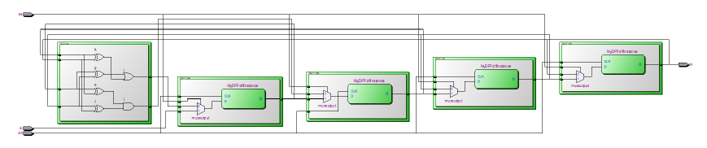

# Assignment - Scan Chain Block
The circuit-under-test CUT diagram is given below. The circuit module should be firstly built using RTL Verilog and the functionality should be verified using a Testbench. A scan chain should be implemented for testability using the Scan D-FF module which has a typical D-FF and the input is selected via the MUX using (SE).

# Scan Test Flow
From the diagram we can understand that the scan chain is comprised of 4 Scan D-FF modules and the test vectors are inputted via SI and SE set to logic 1. Once a test vector is set after 4 clock cycles and Control Points set the inputs of the CUT, SE is set to logic 0 to perform a capture of the observability points which are going to be stored in the Scan D-FFs in the next clock cycle. SE is set back to logic 1 to shift the next test vector into the scan chain while we simultaneously get the response of the previous capture in the SO.

More detailed info, waveforms and testbenches are under the scan-chain-report.pdf

Assignment material provided as part of the Circuit Reliability and Testing Course (Prof. Vasileios Tenentes)

# High level block

# Synthesized Verilog

