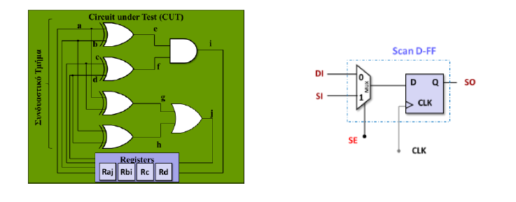

# Scan Chain Block
Basic scan chain block implemented in Verilog for the Circuit Reliability and Testing course (Prof. Vasileios Tenentes)

Detailed report in the repo for more info.

# Synthesized Verilog

